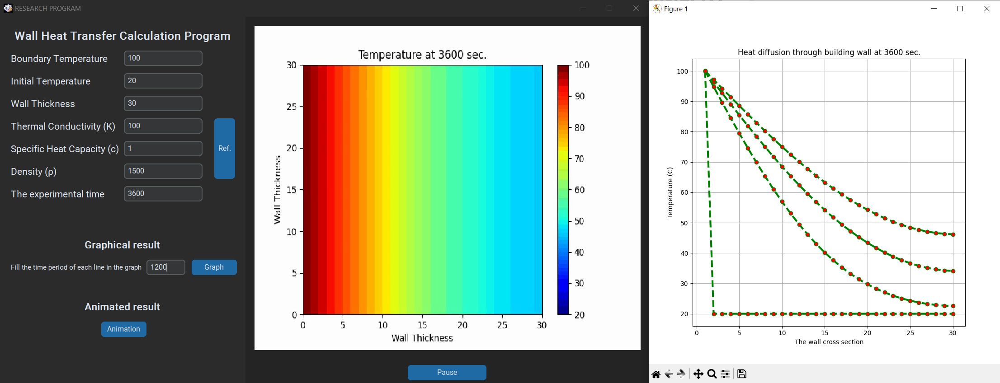
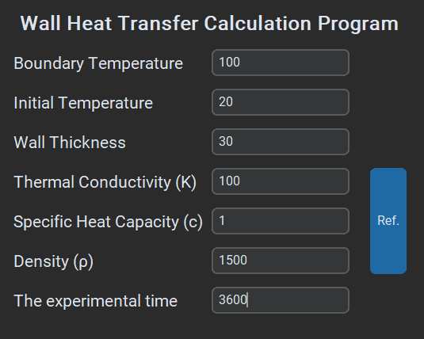
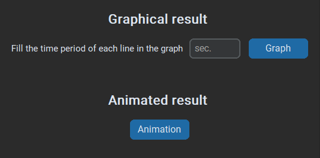
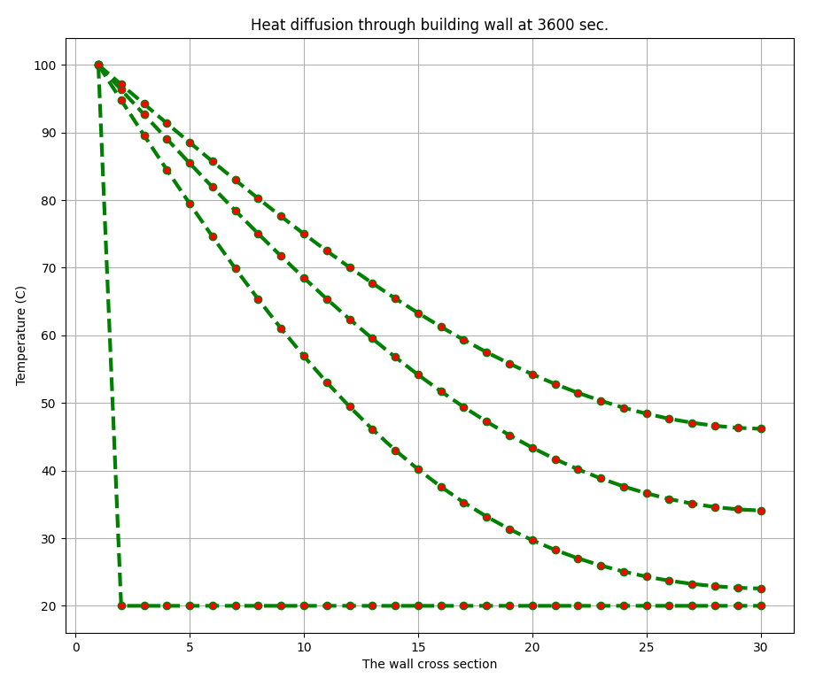

# Program_HeatTransfer1D
This is program for Solving 1D Heat Equation Numerically using Python

# Table of contents

Hi! I'm your first Markdown file in **StackEdit**.

# Run Program_HeatTransfer1D with python
First you need to install all necessary libraries:
```
pip install -r requirements.txt
```
Then you can do:
```
python Code.py
```
Then you will get a program like this:


# How to use
Set the variables as follows:



From here you can choose between two types of results: **graph** and **animations**.



## Graph

If you choose a graph result, you will need to enter a value "Time period of each line"


_From the picture, Time period of each line is equal to 1200 seconds._
###

If you enter the variable values mentioned above You will get **results** like this:


