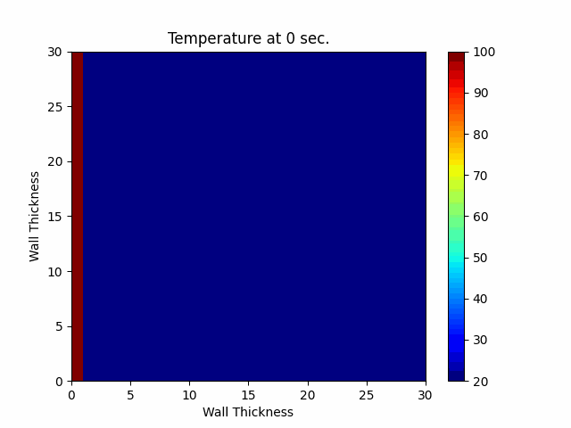

# Program_HeatTransfer1D
This is program for Solving 1D Heat Equation Numerically using Python

# Table of contents

[Run Program_HeatTransfer1D with python](#Run-Program_HeatTransfer1D-with-python)

[How to use](#How-to-use)

[Graph Result](#Graph)

[Animation Result](#Animation)

# Run Program_HeatTransfer1D with python
First you need to install all necessary libraries:
```
pip install -r requirements.txt
```
Then you can do:
```
python Code.py
```
Then you will get a program like this:


# How to use
This is a example you can set the variables as follows:

**WARNING** : Beware about the UNIT!!


From here you can choose between two types of results: **graph** and **animation**.


# Graph

If you choose a graph result, you will need to enter a value "Time period of each line"


_From the picture, Time period of each line is equal to 1200 seconds._

If you enter the variable values mentioned above You will get **results** like this:


_From the picture, This is a Graph result._

# Animation
If you want animation result You just click the animation button and wait a moment.



_This is Animation result._
